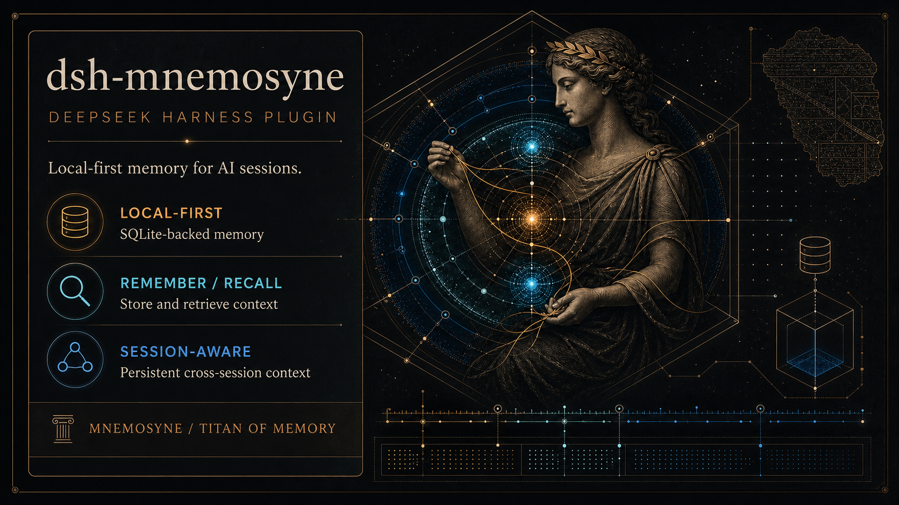

# dsh-mnemosyne

[English](./README.md) | 简体中文

> [Mnemosyne](https://github.com/mnemosyne-oss/mnemosyne) 记忆层在 [DeepSeek Harness](https://github.com/deepseek-ai) 中的插件 — 本地优先、SQLite 支持的跨会话记忆。



> 面向 DSH 的本地优先记忆：跨会话记住、召回并整理上下文。

## 关于 Mnemosyne

[Mnemosyne](https://github.com/mnemosyne-oss/mnemosyne) 是一个零云依赖、SQLite 支持的本地优先 AI 记忆系统。一个 `pip install`，一个 SQLite 文件，无需外部服务。它采用 **BEAM**（Bilevel Episodic-Associative Memory）架构：

- **工作记忆**（Working Memory）— 热上下文层，自动注入 LLM 调用前，基于 TTL 淘汰
- **情景记忆**（Episodic Memory）— 长期存储，sqlite-vec + FTS5 混合检索（50% 向量相似度 + 30% FTS5 排序 + 20% 重要性）
- **知识三元组**（TripleStore）— 带版本链的时序知识图谱

Mnemosyne 支持 MCP、Python SDK 及多种 agent 框架（Claude Code、Cursor、Codex、OpenWebUI、Pi 等）。本插件是其在 DSH 中的集成。

## 关于 Pi-mnemosyne

本插件移植自 [`@mnemosyne-oss/pi-mnemosyne`](https://github.com/mnemosyne-oss/pi-mnemosyne) — Mnemosyne 官方的 [Pi coding agent](https://pi.dev/) 扩展。所有记忆逻辑都在 `mnemosyne` CLI（`pip install mnemosyne-memory`）里，插件保持 CLI 优先：常规共享记忆操作通过子进程调用 CLI。移植到 DSH 时增加了设置面板、CLI 自动安装、配置管理和会话收尾自动整合；并超出原版"无状态代理"的边界，增加了几个不重复实现记忆逻辑的薄桥：经 CLI venv 解释器运行的会话级 Python helper、直连 SQLite 的 scope 迁移，以及写过滤器（`ignore_patterns` / `write_classifier`）的 env 桥接。

## 功能

- **五个原生工具**：`mnemosyne_remember` / `mnemosyne_recall` / `mnemosyne_forget` / `mnemosyne_stats` / `mnemosyne_sleep`
- **内嵌技能**：`mnemosyne` 技能随插件自动注册，指导 agent 何时存储/检索记忆
- **设置面板**：DSH Settings 左侧独立 "Mnemosyne" 入口，含 CLI 状态、记忆统计、一键安装/测试、配置表单
- **自动安装 CLI**：面板 Setup 按钮用 `uv tool install mnemosyne-memory` 自动装好，并补齐 `config.yaml` 默认值
- **数据隔离**：SQLite 库与 `config.yaml` 存于 `~/.dsh/mnemosyne`，不碰 `~/.hermes`
- **配置同步**：面板从扁平的 `config.yaml` 读取 mnemosyne 实际配置，空值字段显示默认值 placeholder；保存后自动执行 `mnemosyne config reload`
- **默认值恢复**：面板底部支持将面板管理的配置恢复为 mnemosyne 默认值
- **自动整理**：每次 `turn/end` 检查工作记忆数量，达到阈值时自动执行 `mnemosyne sleep`
- **自动记忆（可选开启）**：可选功能自动化记忆操作——全部默认关闭，保持手动调用行为不变：
  - **Prompt 声明段** — 在 system prompt 注入 `# Mnemosyne Memory` 头部，让模型知道记忆工具可用
  - **自动存储对话** — 每轮对话后自动将**真实 user 消息**（不含 assistant 输出）存入 Mnemosyne，无需模型主动调用 `mnemosyne_remember`；注入型上下文消息永不入库——`plugin`（如本插件自己的 prefetch 注入）、`agent-instructions`（workspace 指令）、`skill-catalog`（可用技能目录提醒）
  - **自动召回注入** — 每个模型步骤前自动 recall 相关记忆并注入对话流，模型无需调用 `mnemosyne_recall` 即可看到先验上下文
  - **会话隔离** — 按 DSH 会话分区记忆（引擎 `session_id` 列）：每个会话只召回自己的记录 + `global` 作用域的行。子代理与其根会话共享记忆。会话 id 由持久化的 session header（`createdAt`）派生，恢复的会话跨 DSH 重启记忆不丢。`global` 行对所有会话**可读可写**（任何会话也能删除）。面板提供一键把历史 `default` 会话记忆迁移到 `global` 的操作；上游 `cross_session` 召回开关不受支持

## 安装

```bash
dsh plugin --profile web add dsh-mnemosyne
# 重启 profile 后，打开 Settings > Mnemosyne，点 Setup 自动安装 CLI
# 或手动：uv tool install mnemosyne-memory
```

<details>
<summary>从 GitHub 安装（不通过 npm）</summary>

```bash
git clone https://github.com/rebron1900/dsh-mnemosyne.git
dsh plugin --profile web add ./dsh-mnemosyne
```

</details>

> Setup 按钮需要 PATH 上有 `uv`。如果尚未安装 uv：
> ```bash
> curl -LsSf https://astral.sh/uv/install.sh | sh
> ```

## 配置

配置有两个来源：插件自身的 DSH settings（`~/.dsh/settings.yaml` 的 `mnemosyne:` 命名空间）以及 mnemosyne 的扁平 `~/.dsh/mnemosyne/config.yaml`。面板优先显示 config.yaml 中的实际值；缺少值时显示默认值 placeholder。

| 分组 | 字段 | 配置来源 |
|------|------|----------|
| 插件 | `cli` / `defaultTopK` / `timeoutMs` / `dataDir` | DSH settings / `cordis.patch.yml` |
| Embedding | `noEmbeddings` / `embeddingModel` / `embeddingDim` / `embeddingApiUrl` / `embeddingApiKey` | config.yaml `no_embeddings` / `embedding_*` |
| LLM | `llmEnabled` / `llmBaseUrl` / `llmApiKey` / `llmModel` / `llmTimeout` | config.yaml `llm_*` |
| 召回 | `polyphonicRecall` | config.yaml `polyphonic_recall` |
| 工作记忆 | `wmMaxItems` / `wmTtlHours` | config.yaml `wm_*` |
| 工作记忆 | `autoSleep` / `sleepThreshold` / `ignorePatterns` / `syncRoles` | config.yaml `auto_sleep_enabled` / `sleep_threshold` / `ignore_patterns` / `sync_roles` |
| 自动记忆 | `promptSection` / `autoSync` / `autoPrefetch` / `sessionScope` / `prefetchTopK` / `prefetchMinQueryLen` | DSH settings / `cordis.patch.yml` |

> **注意**：自动记忆字段是 DSH 侧配置（通过设置面板保存，不写入 `config.yaml`）。它们通过设置监听器在运行时生效，无需重启 DSH。

> **会话隔离注意事项**：开启 `sessionScope` 会让已有记忆不可见——它们位于历史 `default` 会话中，而会话级召回只看到当前会话 + `global` 行。请先用面板「自动记忆」卡片中的“迁移 default 会话记忆到 global”按钮迁移。反向按钮「将 session-scoped 记忆迁回 default」会有意把 `dsh_*` 行合并进共享历史命名空间，并丢失原会话归属。`global` 行对所有会话可见**且可删除**；插件会强制关闭上游 `cross_session` 召回逃生开关。config 面板只返回它管理的字段（允许列表），密钥类值一律掩码（`***`），真实值不会回传给浏览器。

面板保存会写入对应配置文件，并执行 `mnemosyne config reload`。底部"恢复默认配置"会将面板管理的配置恢复为 mnemosyne 默认值；更多未展示的配置可以直接编辑 `~/.dsh/mnemosyne/config.yaml`。除 `vec_type` 等启动时确定的配置外，大部分配置支持热加载。

面板的 `ignorePatterns`（工作记忆组）是写入过滤器：每行一个正则（Python re 语法），匹配的内容在 `remember()` 时被静默丢弃（如 `^git status`、`^pip install`、`^Traceback`）。插件会把它桥接到 `MNEMOSYNE_IGNORE_PATTERNS` 环境变量（上游写入过滤器只读 env），每次 CLI 调用都生效。在 config.yaml 中加 `write_classifier: strict` 可额外启用内置的噪音/密钥/结构启发式过滤。

## 架构

```
┌──────────────────────────────────────┐
│           DSH Agent Session          │
│  (tools + skill + session/event +    │
│   agent/pre-step + systemPrompt)     │
└──────────────┬───────────────────────┘
               │ execFile (no shell)
┌──────────────▼───────────────────────┐
│         mnemosyne CLI                │
│  store / recall / delete /           │
│  stats / sleep / config              │
└──────────────┬───────────────────────┘
               │
┌──────────────▼───────────────────────┐
│      ~/.dsh/mnemosyne/               │
│  ├── mnemosyne.db (SQLite)           │
│  │   ├── Working Memory (hot tier)   │
│  │   ├── Episodic Memory (long-term) │
│  │   └── TripleStore (temporal KG)   │
│  └── config.yaml (flat key: value)   │
└──────────────────────────────────────┘
```

插件保持 CLI 优先：共享记忆操作调用 `mnemosyne` CLI，会话级操作则通过 CLI venv 解释器运行小型 Python helper。Node 侧不重复实现记忆逻辑。但它已不再是**纯**无状态代理，因为迁移路由会直连 SQLite 写入 scope 元数据，写过滤器 env 桥接每次调用都会读 `config.yaml`。

## 设计与实现方案

见 [docs/design.md](docs/design.md)。

## 开发

```bash
pnpm install
pnpm test        # node --test（99 例：81 单元 + 15 集成 + 3 client）
```

## License

MIT